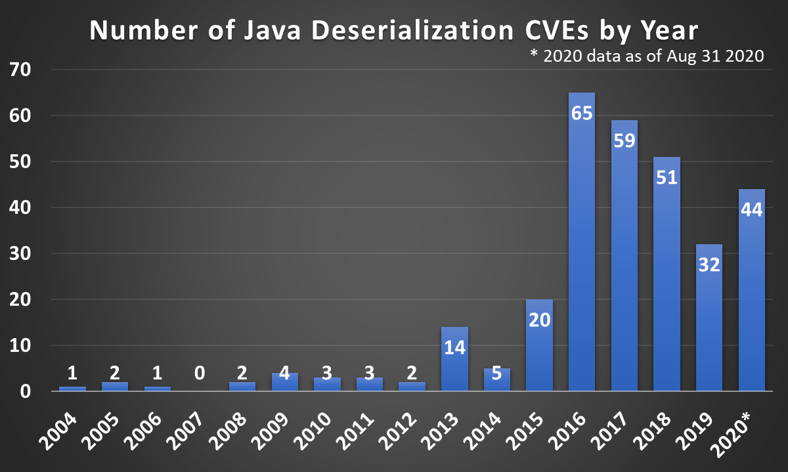

# Java-Deserialization-CVEs

This is a dataset of CVEs related to Java Deserialization. Since existing CVE databases do not allow for granular searches by vulnerability type and language, this list was compiled by manually searching the NIST NVD CVE database with different queries. If you notice any discrepancies, contributions are very welcome!

| CVE ID                                                                | Year | CVSS 3/3.1 risk | CVSS 2 risk |
| --------------------------------------------------------------------- | ---- | --------------- | ----------- |
| [CVE-2004-2540](https://nvd.nist.gov/vuln/detail/CVE-2004-2540)       | 2004 |                 | 5           |
| [CVE-2005-0223](https://nvd.nist.gov/vuln/detail/CVE-2005-0223)       | 2005 |                 | 5           |
| [CVE-2005-3583](https://nvd.nist.gov/vuln/detail/CVE-2005-3583)       | 2005 |                 | 7.8         |
| [CVE-2006-6745](https://nvd.nist.gov/vuln/detail/CVE-2006-6745)       | 2006 |                 | 9.3         |
| [CVE-2008-1013](https://nvd.nist.gov/vuln/detail/CVE-2008-1013)       | 2008 |                 | 6.8         |
| [CVE-2008-5353](https://nvd.nist.gov/vuln/detail/CVE-2008-5353)       | 2008 |                 | 10          |
| [CVE-2009-1094](https://nvd.nist.gov/vuln/detail/CVE-2009-1094)       | 2009 |                 | 10          |
| [CVE-2009-1103](https://nvd.nist.gov/vuln/detail/CVE-2009-1103)       | 2009 |                 | 6.4         |
| [CVE-2009-1190](https://nvd.nist.gov/vuln/detail/CVE-2009-1190)       | 2009 |                 | 5           |
| [CVE-2009-2723](https://nvd.nist.gov/vuln/detail/CVE-2009-2723)       | 2009 |                 | 10          |
| [CVE-2010-0094](https://nvd.nist.gov/vuln/detail/CVE-2010-0094)       | 2010 |                 | 7.5         |
| [CVE-2010-3568](https://nvd.nist.gov/vuln/detail/CVE-2010-3568)       | 2010 |                 | 10          |
| [CVE-2010-3569](https://nvd.nist.gov/vuln/detail/CVE-2010-3569)       | 2010 |                 | 10          |
| [CVE-2011-0865](https://nvd.nist.gov/vuln/detail/CVE-2011-0865)       | 2011 |                 | 2.6         |
| [CVE-2011-2894](https://nvd.nist.gov/vuln/detail/CVE-2011-2894)       | 2011 |                 | 6.8         |
| [CVE-2011-3521](https://nvd.nist.gov/vuln/detail/CVE-2011-3521)       | 2011 |                 | 10          |
| [CVE-2012-0505](https://nvd.nist.gov/vuln/detail/CVE-2012-0505)       | 2012 |                 | 7.5         |
| [CVE-2012-4858](https://nvd.nist.gov/vuln/detail/CVE-2012-4858)       | 2012 |                 | 9.3         |
| [CVE-2013-0433](https://nvd.nist.gov/vuln/detail/CVE-2013-0433)       | 2013 |                 | 5           |
| [CVE-2013-0441](https://nvd.nist.gov/vuln/detail/CVE-2013-0441)       | 2013 |                 | 10          |
| [CVE-2013-1768](https://nvd.nist.gov/vuln/detail/CVE-2013-1768)       | 2013 |                 | 7.5         |
| [CVE-2013-1777](https://nvd.nist.gov/vuln/detail/CVE-2013-1777)       | 2013 |                 | 10          |
| [CVE-2013-2165](https://nvd.nist.gov/vuln/detail/CVE-2013-2165)       | 2013 |                 | 7.5         |
| [CVE-2013-2185](https://nvd.nist.gov/vuln/detail/CVE-2013-2185)       | 2013 |                 | 7.5         |
| [CVE-2013-2186](https://nvd.nist.gov/vuln/detail/CVE-2013-2186)       | 2013 |                 | 7.5         |
| [CVE-2013-2417](https://nvd.nist.gov/vuln/detail/CVE-2013-2417)       | 2013 |                 | 5           |
| [CVE-2013-2450](https://nvd.nist.gov/vuln/detail/CVE-2013-2450)       | 2013 |                 | 5           |
| [CVE-2013-2456](https://nvd.nist.gov/vuln/detail/CVE-2013-2456)       | 2013 |                 | 5           |
| [CVE-2013-4271](https://nvd.nist.gov/vuln/detail/CVE-2013-4271)       | 2013 |                 | 7.5         |
| [CVE-2013-4444](https://nvd.nist.gov/vuln/detail/CVE-2013-4444)       | 2013 |                 | 6.8         |
| [CVE-2013-5456](https://nvd.nist.gov/vuln/detail/CVE-2013-5456)       | 2013 |                 | 9.3         |
| [CVE-2013-6288](https://nvd.nist.gov/vuln/detail/CVE-2013-6288)       | 2013 |                 | 10          |
| [CVE-2014-0416](https://nvd.nist.gov/vuln/detail/CVE-2014-0416)       | 2014 |                 | 5           |
| [CVE-2014-1972](https://nvd.nist.gov/vuln/detail/CVE-2014-1972)       | 2014 |                 | 7.8         |
| [CVE-2014-7911](https://nvd.nist.gov/vuln/detail/CVE-2014-7911)       | 2014 |                 | 7.2         |
| [CVE-2014-9515](https://nvd.nist.gov/vuln/detail/CVE-2014-9515)       | 2014 | 9.8             | 7.5         |
| [CVE-2014-9757](https://nvd.nist.gov/vuln/detail/CVE-2014-9757)       | 2014 | 9.8             | 7.5         |
| [CVE-2015-1920](https://nvd.nist.gov/vuln/detail/CVE-2015-1920)       | 2015 |                 | 10          |
| [CVE-2015-2828](https://nvd.nist.gov/vuln/detail/CVE-2015-2828)       | 2015 |                 | 9           |
| [CVE-2015-3253](https://nvd.nist.gov/vuln/detail/CVE-2015-3253)       | 2015 | 9.8             | 7.5         |
| [CVE-2015-3837](https://nvd.nist.gov/vuln/detail/CVE-2015-3837)       | 2015 |                 | 9.3         |
| [CVE-2015-4805](https://nvd.nist.gov/vuln/detail/CVE-2015-4805)       | 2015 |                 | 10          |
| [CVE-2015-4852](https://nvd.nist.gov/vuln/detail/CVE-2015-4852)       | 2015 |                 | 7.5         |
| [CVE-2015-5254](https://nvd.nist.gov/vuln/detail/CVE-2015-5254)       | 2015 | 9.8             | 7.5         |
| [CVE-2015-5344](https://nvd.nist.gov/vuln/detail/CVE-2015-5344)       | 2015 | 9.8             | 7.5         |
| [CVE-2015-5348](https://nvd.nist.gov/vuln/detail/CVE-2015-5348)       | 2015 | 8.1             | 6.8         |
| [CVE-2015-6420](https://nvd.nist.gov/vuln/detail/CVE-2015-6420)       | 2015 |                 | 7.5         |
| [CVE-2015-6554](https://nvd.nist.gov/vuln/detail/CVE-2015-6554)       | 2015 |                 | 7.5         |
| [CVE-2015-6555](https://nvd.nist.gov/vuln/detail/CVE-2015-6555)       | 2015 |                 | 8.5         |
| [CVE-2015-6576](https://nvd.nist.gov/vuln/detail/CVE-2015-6576)       | 2015 | 8.8             | 6.5         |
| [CVE-2015-6934](https://nvd.nist.gov/vuln/detail/CVE-2015-6934)       | 2015 | 7.3             | 7.5         |
| [CVE-2015-7253](https://nvd.nist.gov/vuln/detail/CVE-2015-7253)       | 2015 |                 | 10          |
| [CVE-2015-7450](https://nvd.nist.gov/vuln/detail/CVE-2015-7450)       | 2015 | 9.8             | 10          |
| [CVE-2015-7501](https://nvd.nist.gov/vuln/detail/CVE-2015-7501)       | 2015 | 9.8             | 10          |
| [CVE-2015-8103](https://nvd.nist.gov/vuln/detail/CVE-2015-8103)       | 2015 |                 | 7.5         |
| [CVE-2015-8360](https://nvd.nist.gov/vuln/detail/CVE-2015-8360)       | 2015 | 9.8             | 7.5         |
| [CVE-2015-8765](https://nvd.nist.gov/vuln/detail/CVE-2015-8765)       | 2015 | 8.3             | 7.5         |
| [CVE-2016-0276](https://nvd.nist.gov/vuln/detail/CVE-2016-0276)       | 2016 | 6.3             | 6.5         |
| [CVE-2016-0360](https://nvd.nist.gov/vuln/detail/CVE-2016-0360)       | 2016 | 9.8             | 7.5         |
| [CVE-2016-0376](https://nvd.nist.gov/vuln/detail/CVE-2016-0376)       | 2016 | 8.1             | 5.1         |
| [CVE-2016-0686](https://nvd.nist.gov/vuln/detail/CVE-2016-0686)       | 2016 | 9.6             | 10          |
| [CVE-2016-0714](https://nvd.nist.gov/vuln/detail/CVE-2016-0714)       | 2016 | 8.8             | 6.5         |
| [CVE-2016-0750](https://nvd.nist.gov/vuln/detail/CVE-2016-0750)       | 2016 | 8.8             | 6.5         |
| [CVE-2016-0779](https://nvd.nist.gov/vuln/detail/CVE-2016-0779)       | 2016 | 9.8             | 7.5         |
| [CVE-2016-0788](https://nvd.nist.gov/vuln/detail/CVE-2016-0788)       | 2016 | 9.8             | 10          |
| [CVE-2016-0958](https://nvd.nist.gov/vuln/detail/CVE-2016-0958)       | 2016 | 7.5             | 7.8         |
| [CVE-2016-1000027](https://nvd.nist.gov/vuln/detail/CVE-2016-1000027) | 2016 | 9.8             | 7.5         |
| [CVE-2016-1000031](https://nvd.nist.gov/vuln/detail/CVE-2016-1000031) | 2016 | 9.8             | 7.5         |
| [CVE-2016-10304](https://nvd.nist.gov/vuln/detail/CVE-2016-10304)     | 2016 | 6.5             | 4           |
| [CVE-2016-10750](https://nvd.nist.gov/vuln/detail/CVE-2016-10750)     | 2016 | 8.1             | 6.8         |
| [CVE-2016-1114](https://nvd.nist.gov/vuln/detail/CVE-2016-1114)       | 2016 | 9.8             | 7.5         |
| [CVE-2016-1291](https://nvd.nist.gov/vuln/detail/CVE-2016-1291)       | 2016 | 9.8             | 9.3         |
| [CVE-2016-1487](https://nvd.nist.gov/vuln/detail/CVE-2016-1487)       | 2016 | 8.8             | 6.8         |
| [CVE-2016-1985](https://nvd.nist.gov/vuln/detail/CVE-2016-1985)       | 2016 | 10              | 10          |
| [CVE-2016-1986](https://nvd.nist.gov/vuln/detail/CVE-2016-1986)       | 2016 | 9.8             | 7.5         |
| [CVE-2016-1997](https://nvd.nist.gov/vuln/detail/CVE-2016-1997)       | 2016 | 9.8             | 10          |
| [CVE-2016-1998](https://nvd.nist.gov/vuln/detail/CVE-2016-1998)       | 2016 | 9.8             | 10          |
| [CVE-2016-1999](https://nvd.nist.gov/vuln/detail/CVE-2016-1999)       | 2016 | 9.8             | 10          |
| [CVE-2016-2000](https://nvd.nist.gov/vuln/detail/CVE-2016-2000)       | 2016 | 9.8             | 7.5         |
| [CVE-2016-2003](https://nvd.nist.gov/vuln/detail/CVE-2016-2003)       | 2016 | 9.8             | 7.5         |
| [CVE-2016-2009](https://nvd.nist.gov/vuln/detail/CVE-2016-2009)       | 2016 | 8.8             | 6.5         |
| [CVE-2016-2170](https://nvd.nist.gov/vuln/detail/CVE-2016-2170)       | 2016 | 9.8             | 7.5         |
| [CVE-2016-2173](https://nvd.nist.gov/vuln/detail/CVE-2016-2173)       | 2016 | 9.8             | 7.5         |
| [CVE-2016-2397](https://nvd.nist.gov/vuln/detail/CVE-2016-2397)       | 2016 | 9.8             | 10          |
| [CVE-2016-2510](https://nvd.nist.gov/vuln/detail/CVE-2016-2510)       | 2016 | 8.1             | 6.8         |
| [CVE-2016-3415](https://nvd.nist.gov/vuln/detail/CVE-2016-3415)       | 2016 | 9.1             | 6.4         |
| [CVE-2016-3427](https://nvd.nist.gov/vuln/detail/CVE-2016-3427)       | 2016 | 9               | 10          |
| [CVE-2016-3461](https://nvd.nist.gov/vuln/detail/CVE-2016-3461)       | 2016 | 7.2             | 4.3         |
| [CVE-2016-3642](https://nvd.nist.gov/vuln/detail/CVE-2016-3642)       | 2016 | 9.8             | 10          |
| [CVE-2016-4000](https://nvd.nist.gov/vuln/detail/CVE-2016-4000)       | 2016 | 9.8             | 7.5         |
| [CVE-2016-4368](https://nvd.nist.gov/vuln/detail/CVE-2016-4368)       | 2016 | 9.8             | 7.5         |
| [CVE-2016-4369](https://nvd.nist.gov/vuln/detail/CVE-2016-4369)       | 2016 | 8.8             | 6.5         |
| [CVE-2016-4372](https://nvd.nist.gov/vuln/detail/CVE-2016-4372)       | 2016 | 9.8             | 7.5         |
| [CVE-2016-4373](https://nvd.nist.gov/vuln/detail/CVE-2016-4373)       | 2016 | 9.8             | 7.5         |
| [CVE-2016-4385](https://nvd.nist.gov/vuln/detail/CVE-2016-4385)       | 2016 | 7.3             | 7.5         |
| [CVE-2016-4398](https://nvd.nist.gov/vuln/detail/CVE-2016-4398)       | 2016 | 8.8             | 6.5         |
| [CVE-2016-4405](https://nvd.nist.gov/vuln/detail/CVE-2016-4405)       | 2016 | 8.8             | 6.5         |
| [CVE-2016-4974](https://nvd.nist.gov/vuln/detail/CVE-2016-4974)       | 2016 | 7.5             | 6           |
| [CVE-2016-4978](https://nvd.nist.gov/vuln/detail/CVE-2016-4978)       | 2016 | 7.2             | 6           |
| [CVE-2016-5003](https://nvd.nist.gov/vuln/detail/CVE-2016-5003)       | 2016 | 9.8             | 7.5         |
| [CVE-2016-5004](https://nvd.nist.gov/vuln/detail/CVE-2016-5004)       | 2016 | 6.5             | 4.3         |
| [CVE-2016-5019](https://nvd.nist.gov/vuln/detail/CVE-2016-5019)       | 2016 | 9.8             | 7.5         |
| [CVE-2016-5229](https://nvd.nist.gov/vuln/detail/CVE-2016-5229)       | 2016 | 9.8             | 7.5         |
| [CVE-2016-5983](https://nvd.nist.gov/vuln/detail/CVE-2016-5983)       | 2016 | 7.5             | 6.5         |
| [CVE-2016-6199](https://nvd.nist.gov/vuln/detail/CVE-2016-6199)       | 2016 | 9.8             | 7.5         |
| [CVE-2016-6496](https://nvd.nist.gov/vuln/detail/CVE-2016-6496)       | 2016 | 9.8             | 7.5         |
| [CVE-2016-6500](https://nvd.nist.gov/vuln/detail/CVE-2016-6500)       | 2016 | 8.1             | 6.8         |
| [CVE-2016-6501](https://nvd.nist.gov/vuln/detail/CVE-2016-6501)       | 2016 | 9.8             | 7.5         |
| [CVE-2016-6793](https://nvd.nist.gov/vuln/detail/CVE-2016-6793)       | 2016 | 9.1             | 6.4         |
| [CVE-2016-6809](https://nvd.nist.gov/vuln/detail/CVE-2016-6809)       | 2016 | 9.8             | 7.5         |
| [CVE-2016-6814](https://nvd.nist.gov/vuln/detail/CVE-2016-6814)       | 2016 | 9.8             | 7.5         |
| [CVE-2016-7065](https://nvd.nist.gov/vuln/detail/CVE-2016-7065)       | 2016 | 8.8             | 6.5         |
| [CVE-2016-7462](https://nvd.nist.gov/vuln/detail/CVE-2016-7462)       | 2016 | 8.5             | 7.5         |
| [CVE-2016-8511](https://nvd.nist.gov/vuln/detail/CVE-2016-8511)       | 2016 | 9.8             | 7.5         |
| [CVE-2016-8648](https://nvd.nist.gov/vuln/detail/CVE-2016-8648)       | 2016 | 7.2             | 6.5         |
| [CVE-2016-8735](https://nvd.nist.gov/vuln/detail/CVE-2016-8735)       | 2016 | 9.8             | 7.5         |
| [CVE-2016-8736](https://nvd.nist.gov/vuln/detail/CVE-2016-8736)       | 2016 | 9.8             | 7.5         |
| [CVE-2016-8744](https://nvd.nist.gov/vuln/detail/CVE-2016-8744)       | 2016 | 8.8             | 9           |
| [CVE-2016-8749](https://nvd.nist.gov/vuln/detail/CVE-2016-8749)       | 2016 | 9.8             | 7.5         |
| [CVE-2016-9299](https://nvd.nist.gov/vuln/detail/CVE-2016-9299)       | 2016 | 9.8             | 7.5         |
| [CVE-2016-9498](https://nvd.nist.gov/vuln/detail/CVE-2016-9498)       | 2016 | 9.8             | 10          |
| [CVE-2016-9606](https://nvd.nist.gov/vuln/detail/CVE-2016-9606)       | 2016 | 8.1             | 6.8         |
| [CVE-2017-1000034](https://nvd.nist.gov/vuln/detail/CVE-2017-1000034) | 2017 | 8.1             | 9.3         |
| [CVE-2017-1000353](https://nvd.nist.gov/vuln/detail/CVE-2017-1000353) | 2017 | 9.8             | 7.5         |
| [CVE-2017-1000355](https://nvd.nist.gov/vuln/detail/CVE-2017-1000355) | 2017 | 6.5             | 4           |
| [CVE-2017-10108](https://nvd.nist.gov/vuln/detail/CVE-2017-10108)     | 2017 | 5.3             | 5           |
| [CVE-2017-10109](https://nvd.nist.gov/vuln/detail/CVE-2017-10109)     | 2017 | 5.3             | 5           |
| [CVE-2017-10271](https://nvd.nist.gov/vuln/detail/CVE-2017-10271)     | 2017 | 7.5             | 5           |
| [CVE-2017-10281](https://nvd.nist.gov/vuln/detail/CVE-2017-10281)     | 2017 | 5.3             | 5           |
| [CVE-2017-10345](https://nvd.nist.gov/vuln/detail/CVE-2017-10345)     | 2017 | 3.1             | 2.6         |
| [CVE-2017-10347](https://nvd.nist.gov/vuln/detail/CVE-2017-10347)     | 2017 | 5.3             | 5           |
| [CVE-2017-10357](https://nvd.nist.gov/vuln/detail/CVE-2017-10357)     | 2017 | 5.3             | 5           |
| [CVE-2017-10932](https://nvd.nist.gov/vuln/detail/CVE-2017-10932)     | 2017 | 9.8             | 10          |
| [CVE-2017-10934](https://nvd.nist.gov/vuln/detail/CVE-2017-10934)     | 2017 | 9.8             | 7.5         |
| [CVE-2017-10992](https://nvd.nist.gov/vuln/detail/CVE-2017-10992)     | 2017 | 9.8             | 10          |
| [CVE-2017-11283](https://nvd.nist.gov/vuln/detail/CVE-2017-11283)     | 2017 | 9.8             | 7.5         |
| [CVE-2017-11284](https://nvd.nist.gov/vuln/detail/CVE-2017-11284)     | 2017 | 9.8             | 7.5         |
| [CVE-2017-12149](https://nvd.nist.gov/vuln/detail/CVE-2017-12149)     | 2017 | 9.8             | 7.5         |
| [CVE-2017-12557](https://nvd.nist.gov/vuln/detail/CVE-2017-12557)     | 2017 | 9.8             | 10          |
| [CVE-2017-12628](https://nvd.nist.gov/vuln/detail/CVE-2017-12628)     | 2017 | 7.8             | 7.2         |
| [CVE-2017-12633](https://nvd.nist.gov/vuln/detail/CVE-2017-12633)     | 2017 | 9.8             | 7.5         |
| [CVE-2017-12634](https://nvd.nist.gov/vuln/detail/CVE-2017-12634)     | 2017 | 9.8             | 7.5         |
| [CVE-2017-13286](https://nvd.nist.gov/vuln/detail/CVE-2017-13286)     | 2017 | 7.8             | 7.2         |
| [CVE-2017-15089](https://nvd.nist.gov/vuln/detail/CVE-2017-15089)     | 2017 | 8.8             | 6.5         |
| [CVE-2017-15095](https://nvd.nist.gov/vuln/detail/CVE-2017-15095)     | 2017 | 9.8             | 7.5         |
| [CVE-2017-15692](https://nvd.nist.gov/vuln/detail/CVE-2017-15692)     | 2017 | 9.8             | 7.5         |
| [CVE-2017-15693](https://nvd.nist.gov/vuln/detail/CVE-2017-15693)     | 2017 | 7.5             | 6           |
| [CVE-2017-15703](https://nvd.nist.gov/vuln/detail/CVE-2017-15703)     | 2017 | 5               | 3.5         |
| [CVE-2017-15708](https://nvd.nist.gov/vuln/detail/CVE-2017-15708)     | 2017 | 9.8             | 7.5         |
| [CVE-2017-17485](https://nvd.nist.gov/vuln/detail/CVE-2017-17485)     | 2017 | 9.8             | 7.5         |
| [CVE-2017-2608](https://nvd.nist.gov/vuln/detail/CVE-2017-2608)       | 2017 | 8.8             | 6.5         |
| [CVE-2017-3066](https://nvd.nist.gov/vuln/detail/CVE-2017-3066)       | 2017 | 9.8             | 10          |
| [CVE-2017-3159](https://nvd.nist.gov/vuln/detail/CVE-2017-3159)       | 2017 | 9.8             | 7.5         |
| [CVE-2017-3199](https://nvd.nist.gov/vuln/detail/CVE-2017-3199)       | 2017 | 8.1             | 6.8         |
| [CVE-2017-3200](https://nvd.nist.gov/vuln/detail/CVE-2017-3200)       | 2017 | 8.1             | 6.8         |
| [CVE-2017-3201](https://nvd.nist.gov/vuln/detail/CVE-2017-3201)       | 2017 | 8.1             | 6.8         |
| [CVE-2017-3202](https://nvd.nist.gov/vuln/detail/CVE-2017-3202)       | 2017 | 9.8             | 7.5         |
| [CVE-2017-3203](https://nvd.nist.gov/vuln/detail/CVE-2017-3203)       | 2017 | 8.1             | 6.8         |
| [CVE-2017-3206](https://nvd.nist.gov/vuln/detail/CVE-2017-3206)       | 2017 | 9.8             | 7.5         |
| [CVE-2017-3207](https://nvd.nist.gov/vuln/detail/CVE-2017-3207)       | 2017 | 9.8             | 7.5         |
| [CVE-2017-3208](https://nvd.nist.gov/vuln/detail/CVE-2017-3208)       | 2017 | 9.8             | 7.5         |
| [CVE-2017-3241](https://nvd.nist.gov/vuln/detail/CVE-2017-3241)       | 2017 | 9               | 6.8         |
| [CVE-2017-3248](https://nvd.nist.gov/vuln/detail/CVE-2017-3248)       | 2017 | 9.8             | 7.5         |
| [CVE-2017-3506](https://nvd.nist.gov/vuln/detail/CVE-2017-3506)       | 2017 | 7.4             | 5.8         |
| [CVE-2017-3523](https://nvd.nist.gov/vuln/detail/CVE-2017-3523)       | 2017 | 8.5             | 6           |
| [CVE-2017-4995](https://nvd.nist.gov/vuln/detail/CVE-2017-4995)       | 2017 | 8.1             | 6.8         |
| [CVE-2017-5586](https://nvd.nist.gov/vuln/detail/CVE-2017-5586)       | 2017 | 9.8             | 7.5         |
| [CVE-2017-5636](https://nvd.nist.gov/vuln/detail/CVE-2017-5636)       | 2017 | 9.8             | 7.5         |
| [CVE-2017-5641](https://nvd.nist.gov/vuln/detail/CVE-2017-5641)       | 2017 | 9.8             | 7.5         |
| [CVE-2017-5645](https://nvd.nist.gov/vuln/detail/CVE-2017-5645)       | 2017 | 9.8             | 7.5         |
| [CVE-2017-5792](https://nvd.nist.gov/vuln/detail/CVE-2017-5792)       | 2017 | 9.8             | 7.5         |
| [CVE-2017-5878](https://nvd.nist.gov/vuln/detail/CVE-2017-5878)       | 2017 | 9.8             | 7.5         |
| [CVE-2017-5929](https://nvd.nist.gov/vuln/detail/CVE-2017-5929)       | 2017 | 9.8             | 7.5         |
| [CVE-2017-5983](https://nvd.nist.gov/vuln/detail/CVE-2017-5983)       | 2017 | 9.8             | 7.5         |
| [CVE-2017-7504](https://nvd.nist.gov/vuln/detail/CVE-2017-7504)       | 2017 | 9.8             | 7.5         |
| [CVE-2017-7525](https://nvd.nist.gov/vuln/detail/CVE-2017-7525)       | 2017 | 9.8             | 7.5         |
| [CVE-2017-8012](https://nvd.nist.gov/vuln/detail/CVE-2017-8012)       | 2017 | 7.4             | 5.8         |
| [CVE-2017-9363](https://nvd.nist.gov/vuln/detail/CVE-2017-9363)       | 2017 | 9.8             | 7.5         |
| [CVE-2017-9805](https://nvd.nist.gov/vuln/detail/CVE-2017-9805)       | 2017 | 8.1             | 6.8         |
| [CVE-2017-9830](https://nvd.nist.gov/vuln/detail/CVE-2017-9830)       | 2017 | 9.8             | 7.5         |
| [CVE-2017-9844](https://nvd.nist.gov/vuln/detail/CVE-2017-9844)       | 2017 | 9.8             | 7.5         |
| [CVE-2018-0147](https://nvd.nist.gov/vuln/detail/CVE-2018-0147)       | 2018 | 9.8             | 10          |
| [CVE-2018-1000058](https://nvd.nist.gov/vuln/detail/CVE-2018-1000058) | 2018 | 8.8             | 6.5         |
| [CVE-2018-1000613](https://nvd.nist.gov/vuln/detail/CVE-2018-1000613) | 2018 | 9.8             | 7.5         |
| [CVE-2018-1000861](https://nvd.nist.gov/vuln/detail/CVE-2018-1000861) | 2018 | 9.8             | 10          |
| [CVE-2018-1000873](https://nvd.nist.gov/vuln/detail/CVE-2018-1000873) | 2018 | 6.5             | 4.3         |
| [CVE-2018-10237](https://nvd.nist.gov/vuln/detail/CVE-2018-10237)     | 2018 | 5.9             | 4.3         |
| [CVE-2018-10654](https://nvd.nist.gov/vuln/detail/CVE-2018-10654)     | 2018 | 8.1             | 6.8         |
| [CVE-2018-11247](https://nvd.nist.gov/vuln/detail/CVE-2018-11247)     | 2018 | 9.8             | 7.5         |
| [CVE-2018-11779](https://nvd.nist.gov/vuln/detail/CVE-2018-11779)     | 2018 | 9.8             | 7.5         |
| [CVE-2018-12532](https://nvd.nist.gov/vuln/detail/CVE-2018-12532)     | 2018 | 9.8             | 7.5         |
| [CVE-2018-12539](https://nvd.nist.gov/vuln/detail/CVE-2018-12539)     | 2018 | 7.8             | 4.6         |
| [CVE-2018-1295](https://nvd.nist.gov/vuln/detail/CVE-2018-1295)       | 2018 | 9.8             | 7.5         |
| [CVE-2018-1297](https://nvd.nist.gov/vuln/detail/CVE-2018-1297)       | 2018 | 9.8             | 7.5         |
| [CVE-2018-1310](https://nvd.nist.gov/vuln/detail/CVE-2018-1310)       | 2018 | 7.5             | 5           |
| [CVE-2018-14667](https://nvd.nist.gov/vuln/detail/CVE-2018-14667)     | 2018 | 9.8             | 7.5         |
| [CVE-2018-14718](https://nvd.nist.gov/vuln/detail/CVE-2018-14718)     | 2018 | 9.8             | 7.5         |
| [CVE-2018-14719](https://nvd.nist.gov/vuln/detail/CVE-2018-14719)     | 2018 | 9.8             | 7.5         |
| [CVE-2018-14720](https://nvd.nist.gov/vuln/detail/CVE-2018-14720)     | 2018 | 9.8             | 7.5         |
| [CVE-2018-14721](https://nvd.nist.gov/vuln/detail/CVE-2018-14721)     | 2018 | 10              | 7.5         |
| [CVE-2018-15381](https://nvd.nist.gov/vuln/detail/CVE-2018-15381)     | 2018 | 9.8             | 10          |
| [CVE-2018-1567](https://nvd.nist.gov/vuln/detail/CVE-2018-1567)       | 2018 | 9.8             | 7.5         |
| [CVE-2018-15890](https://nvd.nist.gov/vuln/detail/CVE-2018-15890)     | 2018 | 9.8             | 10          |
| [CVE-2018-17200](https://nvd.nist.gov/vuln/detail/CVE-2018-17200)     | 2018 | 9.8             | 7.5         |
| [CVE-2018-18013](https://nvd.nist.gov/vuln/detail/CVE-2018-18013)     | 2018 | 7.8             | 7.2         |
| [CVE-2018-18628](https://nvd.nist.gov/vuln/detail/CVE-2018-18628)     | 2018 | 9.8             | 10          |
| [CVE-2018-1904](https://nvd.nist.gov/vuln/detail/CVE-2018-1904)       | 2018 | 9.8             | 7.5         |
| [CVE-2018-19276](https://nvd.nist.gov/vuln/detail/CVE-2018-19276)     | 2018 | 9.8             | 10          |
| [CVE-2018-19360](https://nvd.nist.gov/vuln/detail/CVE-2018-19360)     | 2018 | 9.8             | 7.5         |
| [CVE-2018-19361](https://nvd.nist.gov/vuln/detail/CVE-2018-19361)     | 2018 | 9.8             | 7.5         |
| [CVE-2018-19362](https://nvd.nist.gov/vuln/detail/CVE-2018-19362)     | 2018 | 9.8             | 7.5         |
| [CVE-2018-1999042](https://nvd.nist.gov/vuln/detail/CVE-2018-1999042) | 2018 | 5.3             | 5           |
| [CVE-2018-20732](https://nvd.nist.gov/vuln/detail/CVE-2018-20732)     | 2018 | 9.8             | 7.5         |
| [CVE-2018-2628](https://nvd.nist.gov/vuln/detail/CVE-2018-2628)       | 2018 | 9.8             | 7.5         |
| [CVE-2018-2657](https://nvd.nist.gov/vuln/detail/CVE-2018-2657)       | 2018 | 5.3             | 5           |
| [CVE-2018-2677](https://nvd.nist.gov/vuln/detail/CVE-2018-2677)       | 2018 | 4.3             | 4.3         |
| [CVE-2018-2815](https://nvd.nist.gov/vuln/detail/CVE-2018-2815)       | 2018 | 5.3             | 5           |
| [CVE-2018-2893](https://nvd.nist.gov/vuln/detail/CVE-2018-2893)       | 2018 | 9.8             | 7.5         |
| [CVE-2018-3004](https://nvd.nist.gov/vuln/detail/CVE-2018-3004)       | 2018 | 5.3             | 3.5         |
| [CVE-2018-3191](https://nvd.nist.gov/vuln/detail/CVE-2018-3191)       | 2018 | 9.8             | 7.5         |
| [CVE-2018-3245](https://nvd.nist.gov/vuln/detail/CVE-2018-3245)       | 2018 | 9.8             | 7.5         |
| [CVE-2018-3252](https://nvd.nist.gov/vuln/detail/CVE-2018-3252)       | 2018 | 9.8             | 7.5         |
| [CVE-2018-4939](https://nvd.nist.gov/vuln/detail/CVE-2018-4939)       | 2018 | 9.8             | 10          |
| [CVE-2018-5393](https://nvd.nist.gov/vuln/detail/CVE-2018-5393)       | 2018 | 9.8             | 10          |
| [CVE-2018-5968](https://nvd.nist.gov/vuln/detail/CVE-2018-5968)       | 2018 | 8.1             | 5.1         |
| [CVE-2018-6331](https://nvd.nist.gov/vuln/detail/CVE-2018-6331)       | 2018 | 9.8             | 7.5         |
| [CVE-2018-7489](https://nvd.nist.gov/vuln/detail/CVE-2018-7489)       | 2018 | 9.8             | 7.5         |
| [CVE-2018-8013](https://nvd.nist.gov/vuln/detail/CVE-2018-8013)       | 2018 | 9.8             | 7.5         |
| [CVE-2018-8016](https://nvd.nist.gov/vuln/detail/CVE-2018-8016)       | 2018 | 9.8             | 7.5         |
| [CVE-2018-8018](https://nvd.nist.gov/vuln/detail/CVE-2018-8018)       | 2018 | 9.8             | 7.5         |
| [CVE-2018-9522](https://nvd.nist.gov/vuln/detail/CVE-2018-9522)       | 2018 | 7.8             | 7.2         |
| [CVE-2018-9523](https://nvd.nist.gov/vuln/detail/CVE-2018-9523)       | 2018 | 7.8             | 7.2         |
| [CVE-2019-0187](https://nvd.nist.gov/vuln/detail/CVE-2019-0187)       | 2019 | 9.8             | 7.5         |
| [CVE-2019-0189](https://nvd.nist.gov/vuln/detail/CVE-2019-0189)       | 2019 | 9.8             | 7.5         |
| [CVE-2019-0192](https://nvd.nist.gov/vuln/detail/CVE-2019-0192)       | 2019 | 9.8             | 7.5         |
| [CVE-2019-0195](https://nvd.nist.gov/vuln/detail/CVE-2019-0195)       | 2019 | 9.8             | 7.5         |
| [CVE-2019-0305](https://nvd.nist.gov/vuln/detail/CVE-2019-0305)       | 2019 | 4.3             | 4.3         |
| [CVE-2019-0344](https://nvd.nist.gov/vuln/detail/CVE-2019-0344)       | 2019 | 9.8             | 7.5         |
| [CVE-2019-10086](https://nvd.nist.gov/vuln/detail/CVE-2019-10086)     | 2019 | 7.3             | 7.5         |
| [CVE-2019-10202](https://nvd.nist.gov/vuln/detail/CVE-2019-10202)     | 2019 | 9.8             | 7.5         |
| [CVE-2019-12384](https://nvd.nist.gov/vuln/detail/CVE-2019-12384)     | 2019 | 5.9             | 4.3         |
| [CVE-2019-12630](https://nvd.nist.gov/vuln/detail/CVE-2019-12630)     | 2019 | 9.8             | 7.5         |
| [CVE-2019-13116](https://nvd.nist.gov/vuln/detail/CVE-2019-13116)     | 2019 | 9.8             | 7.5         |
| [CVE-2019-14224](https://nvd.nist.gov/vuln/detail/CVE-2019-14224)     | 2019 | 7.2             | 9           |
| [CVE-2019-14540](https://nvd.nist.gov/vuln/detail/CVE-2019-14540)     | 2019 | 9.8             | 7.5         |
| [CVE-2019-14892](https://nvd.nist.gov/vuln/detail/CVE-2019-14892)     | 2019 | 9.8             | 7.5         |
| [CVE-2019-14893](https://nvd.nist.gov/vuln/detail/CVE-2019-14893)     | 2019 | 9.8             | 7.5         |
| [CVE-2019-16112](https://nvd.nist.gov/vuln/detail/CVE-2019-16112)     | 2019 | 8.8             | 6.5         |
| [CVE-2019-16891](https://nvd.nist.gov/vuln/detail/CVE-2019-16891)     | 2019 | 8.8             | 6.5         |
| [CVE-2019-17556](https://nvd.nist.gov/vuln/detail/CVE-2019-17556)     | 2019 | 9.8             | 10          |
| [CVE-2019-17564](https://nvd.nist.gov/vuln/detail/CVE-2019-17564)     | 2019 | 9.8             | 6.8         |
| [CVE-2019-17570](https://nvd.nist.gov/vuln/detail/CVE-2019-17570)     | 2019 | 9.8             | 7.5         |
| [CVE-2019-17571](https://nvd.nist.gov/vuln/detail/CVE-2019-17571)     | 2019 | 9.8             | 7.5         |
| [CVE-2019-18364](https://nvd.nist.gov/vuln/detail/CVE-2019-18364)     | 2019 | 9.8             | 7.5         |
| [CVE-2019-18580](https://nvd.nist.gov/vuln/detail/CVE-2019-18580)     | 2019 | 10              | 10          |
| [CVE-2019-18956](https://nvd.nist.gov/vuln/detail/CVE-2019-18956)     | 2019 | 9.8             | 7.5         |
| [CVE-2019-2725](https://nvd.nist.gov/vuln/detail/CVE-2019-2725)       | 2019 | 9.8             | 7.5         |
| [CVE-2019-2983](https://nvd.nist.gov/vuln/detail/CVE-2019-2983)       | 2019 | 3.7             | 4.3         |
| [CVE-2019-5326](https://nvd.nist.gov/vuln/detail/CVE-2019-5326)       | 2019 | 7.2             | 6.5         |
| [CVE-2019-6503](https://nvd.nist.gov/vuln/detail/CVE-2019-6503)       | 2019 | 9.8             | 7.5         |
| [CVE-2019-7727](https://nvd.nist.gov/vuln/detail/CVE-2019-7727)       | 2019 | 9.8             | 7.5         |
| [CVE-2019-7839](https://nvd.nist.gov/vuln/detail/CVE-2019-7839)       | 2019 | 9.8             | 10          |
| [CVE-2019-8352](https://nvd.nist.gov/vuln/detail/CVE-2019-8352)       | 2019 | 9.8             | 7.5         |
| [CVE-2019-9212](https://nvd.nist.gov/vuln/detail/CVE-2019-9212)       | 2019 | 9.8             | 7.5         |
| [CVE-2020-0082](https://nvd.nist.gov/vuln/detail/CVE-2020-0082)       | 2020 | 7.8             | 7.2         |
| [CVE-2020-10189](https://nvd.nist.gov/vuln/detail/CVE-2020-10189)     | 2020 | 9.8             | 10          |
| [CVE-2020-10644](https://nvd.nist.gov/vuln/detail/CVE-2020-10644)     | 2020 | 7.5             | 5           |
| [CVE-2020-10672](https://nvd.nist.gov/vuln/detail/CVE-2020-10672)     | 2020 | 8.8             | 6.8         |
| [CVE-2020-10673](https://nvd.nist.gov/vuln/detail/CVE-2020-10673)     | 2020 | 8.8             | 6.8         |
| [CVE-2020-10740](https://nvd.nist.gov/vuln/detail/CVE-2020-10740)     | 2020 | 7.5             | 6           |
| [CVE-2020-10917](https://nvd.nist.gov/vuln/detail/CVE-2020-10917)     | 2020 | 9.8             | 7.5         |
| [CVE-2020-10969](https://nvd.nist.gov/vuln/detail/CVE-2020-10969)     | 2020 | 8.8             | 6.8         |
| [CVE-2020-11111](https://nvd.nist.gov/vuln/detail/CVE-2020-11111)     | 2020 | 8.8             | 6.8         |
| [CVE-2020-11112](https://nvd.nist.gov/vuln/detail/CVE-2020-11112)     | 2020 | 8.8             | 6.8         |
| [CVE-2020-11113](https://nvd.nist.gov/vuln/detail/CVE-2020-11113)     | 2020 | 8.8             | 6.8         |
| [CVE-2020-11620](https://nvd.nist.gov/vuln/detail/CVE-2020-11620)     | 2020 | 9.8             | 6.8         |
| [CVE-2020-11972](https://nvd.nist.gov/vuln/detail/CVE-2020-11972)     | 2020 | 9.8             | 7.5         |
| [CVE-2020-11973](https://nvd.nist.gov/vuln/detail/CVE-2020-11973)     | 2020 | 9.8             | 7.5         |
| [CVE-2020-12000](https://nvd.nist.gov/vuln/detail/CVE-2020-12000)     | 2020 | 7.5             | 5           |
| [CVE-2020-12133](https://nvd.nist.gov/vuln/detail/CVE-2020-12133)     | 2020 | 9.8             | 10          |
| [CVE-2020-12760](https://nvd.nist.gov/vuln/detail/CVE-2020-12760)     | 2020 | 8.8             | 6.5         |
| [CVE-2020-12835](https://nvd.nist.gov/vuln/detail/CVE-2020-12835)     | 2020 | 9.8             | 7.5         |
| [CVE-2020-15842](https://nvd.nist.gov/vuln/detail/CVE-2020-15842)     | 2020 | 8.1             | 6.8         |
| [CVE-2020-1714](https://nvd.nist.gov/vuln/detail/CVE-2020-1714)       | 2020 | 8.8             | 6.5         |
| [CVE-2020-1947](https://nvd.nist.gov/vuln/detail/CVE-2020-1947)       | 2020 | 9.8             | 7.5         |
| [CVE-2020-1948](https://nvd.nist.gov/vuln/detail/CVE-2020-1948)       | 2020 | 9.8             | 7.5         |
| [CVE-2020-2551](https://nvd.nist.gov/vuln/detail/CVE-2020-2551)       | 2020 | 9.8             | 7.5         |
| [CVE-2020-2555](https://nvd.nist.gov/vuln/detail/CVE-2020-2555)       | 2020 | 9.8             | 7.5         |
| [CVE-2020-2583](https://nvd.nist.gov/vuln/detail/CVE-2020-2583)       | 2020 | 3.7             | 4.3         |
| [CVE-2020-2604](https://nvd.nist.gov/vuln/detail/CVE-2020-2604)       | 2020 | 8.1             | 6.8         |
| [CVE-2020-2756](https://nvd.nist.gov/vuln/detail/CVE-2020-2756)       | 2020 | 3.7             | 4.3         |
| [CVE-2020-2757](https://nvd.nist.gov/vuln/detail/CVE-2020-2757)       | 2020 | 3.7             | 4.3         |
| [CVE-2020-2883](https://nvd.nist.gov/vuln/detail/CVE-2020-2883)       | 2020 | 9.8             | 7.5         |
| [CVE-2020-2950](https://nvd.nist.gov/vuln/detail/CVE-2020-2950)       | 2020 | 9.8             | 7.5         |
| [CVE-2020-3280](https://nvd.nist.gov/vuln/detail/CVE-2020-3280)       | 2020 | 9.8             | 10          |
| [CVE-2020-4305](https://nvd.nist.gov/vuln/detail/CVE-2020-4305)       | 2020 | 8.8             | 9.3         |
| [CVE-2020-4448](https://nvd.nist.gov/vuln/detail/CVE-2020-4448)       | 2020 | 9.8             | 10          |
| [CVE-2020-4449](https://nvd.nist.gov/vuln/detail/CVE-2020-4449)       | 2020 | 7.5             | 5           |
| [CVE-2020-4450](https://nvd.nist.gov/vuln/detail/CVE-2020-4450)       | 2020 | 9.8             | 10          |
| [CVE-2020-5327](https://nvd.nist.gov/vuln/detail/CVE-2020-5327)       | 2020 | 9.8             | 9.3         |
| [CVE-2020-5411](https://nvd.nist.gov/vuln/detail/CVE-2020-5411)       | 2020 | 8.1             | 6.8         |
| [CVE-2020-5413](https://nvd.nist.gov/vuln/detail/CVE-2020-5413)       | 2020 | 9.8             | 7.5         |
| [CVE-2020-7961](https://nvd.nist.gov/vuln/detail/CVE-2020-7961)       | 2020 | 9.8             | 7.5         |
| [CVE-2020-8840](https://nvd.nist.gov/vuln/detail/CVE-2020-8840)       | 2020 | 9.8             | 7.5         |
| [CVE-2020-9484](https://nvd.nist.gov/vuln/detail/CVE-2020-9484)       | 2020 | 7               | 4.4         |
| [CVE-2020-9546](https://nvd.nist.gov/vuln/detail/CVE-2020-9546)       | 2020 | 9.8             | 6.8         |
| [CVE-2020-9547](https://nvd.nist.gov/vuln/detail/CVE-2020-9547)       | 2020 | 9.8             | 6.8         |
| [CVE-2020-9548](https://nvd.nist.gov/vuln/detail/CVE-2020-9548)       | 2020 | 9.8             | 6.8         |

